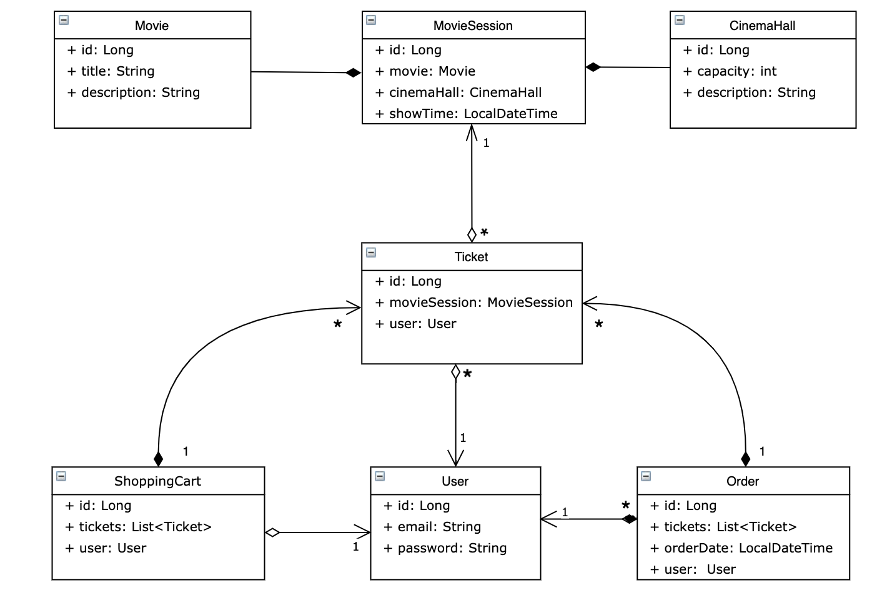
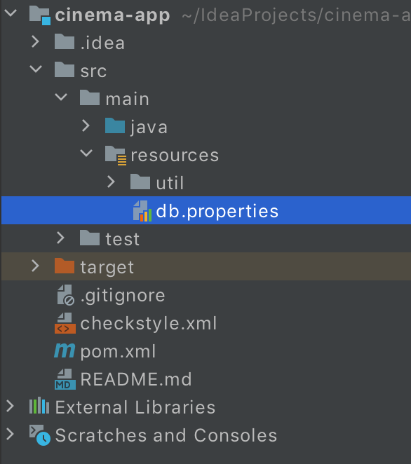
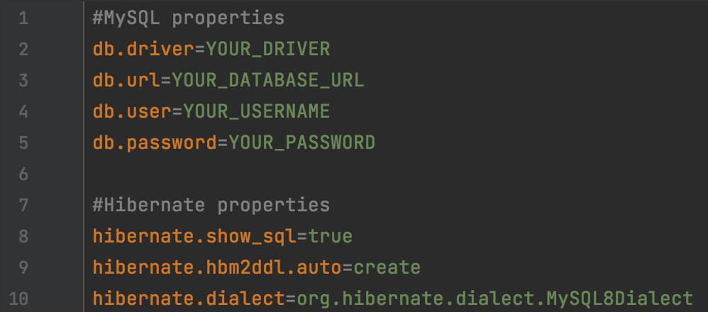
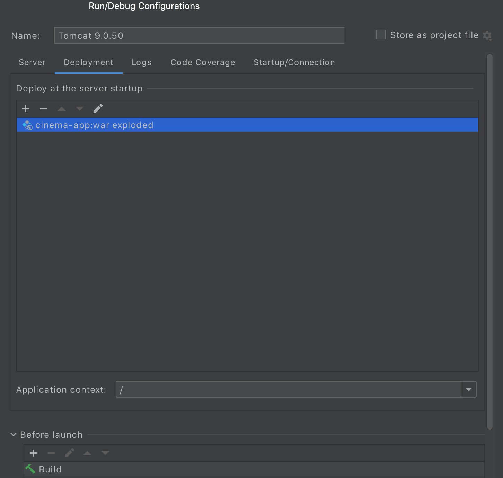

#  CINEMA-APP

#  DESCRIPTION
This a simple simulator of cinema service, built on the Hibernate and Spring framework.

The application includes features such as user authentication, registration, and CRUD operations.

#  Features
- Authentication / authorization  
- Create and find movies  
- Create and find cinema halls  
- Create and find available movie sessions  
- Add tickets to shopping cart
- Complete an order and get a history of orders

#  Structure

#  Used Technologies
- JDK 17  
- MAVEN 4.0.0  
- SPRING 5.3.20  
- SPRING SECURITY 5.6.10
- HIBERNATE 5.6.14  
- MYSQL 8.0.22  
- JAVA SERVLETS 4.0.1  
- JACKSON CORE 2.14.1  
- TOMCAT 9.0.50  

#  Getting Started
#### Prerequisites:
- Java 17 or later  
- Apache Tomcat 9 (version 9.0.50 is recommended)  
- MySQL 8 or later  
- Spring 5 or later  
- Hibernate 5 or later  

#### Install process
1. Clone this repository.
2. Open the project in your IDE and build it.
3. Open the db.properties file (/src/main/resources/db.properties) and change the information about database connection.

4. Configure Tomcat.
   #### Use only Tomcat 9
    - choose war exploded  
      
5. Launch the application and begin using it.
6. Use [postman](https://www.postman.com/) to test application

# Authors
#### Voronov Vladyslav
